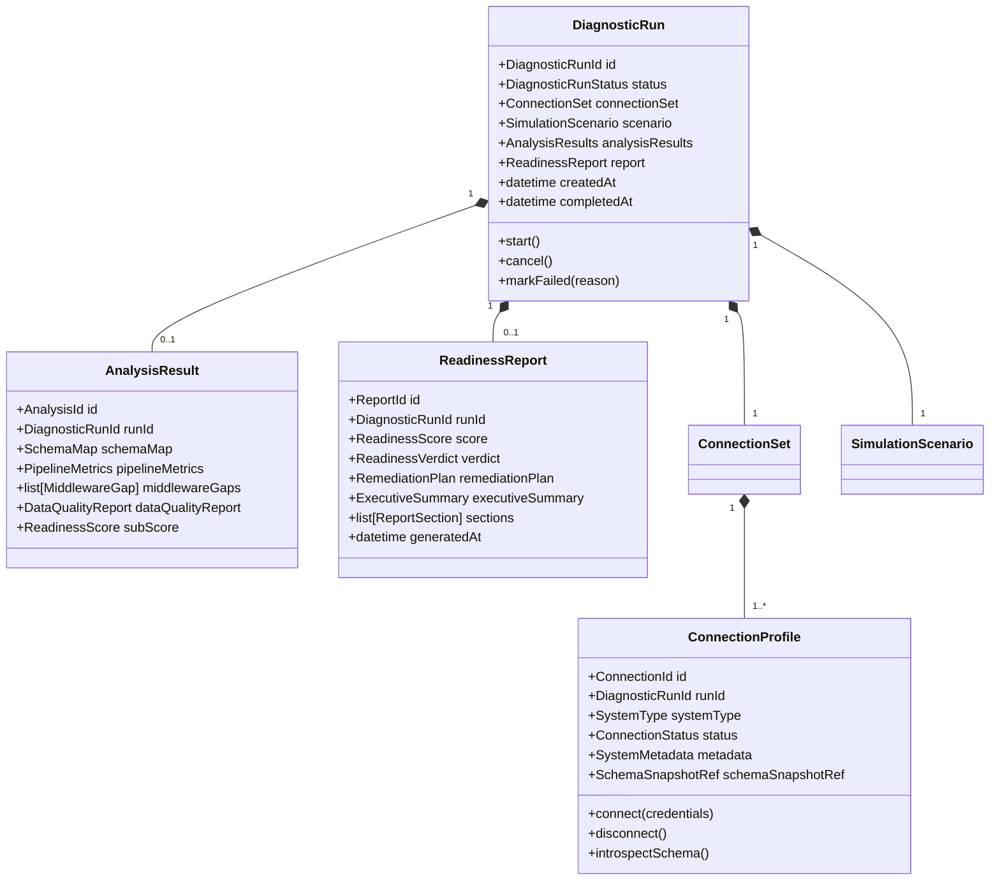
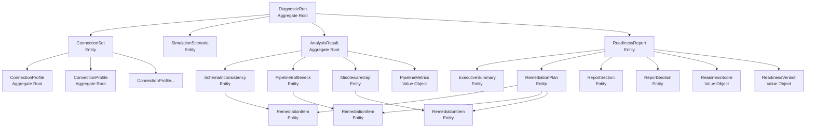

# Domain Model — Preflight Integration Tester

This document is the authoritative reference for Preflight's domain model. It defines all aggregates, entities, and value objects with their invariants, properties, and relationships.

---

## Domain Model Overview



---

## Aggregates

### Aggregate: DiagnosticRun

The central aggregate of the Preflight domain. Represents a complete, end-to-end readiness assessment session. All other domain objects are either owned by or traced back to a `DiagnosticRun`.

**Aggregate Root**: `DiagnosticRun` identified by `DiagnosticRunId`

**Owned entities and value objects**:
- `ConnectionSet` (entity) — the set of connected enterprise systems
- `SimulationScenario` (entity) — description of the AI workload being assessed
- `AnalysisResults` (entity) — container for all analysis findings
- `ReadinessReport` (entity) — the final diagnostic output

**State machine**:

```
PENDING
  │
  ▼ start()
CONNECTING ──── ConnectionFailed ──────────────────▶ FAILED
  │
  ▼ ConnectionSetReady published
SIMULATING ──── SimulationFailed ─────────────────▶ FAILED
  │
  ▼ SimulationCompleted published
ANALYSING ──── AnalysisFailed ────────────────────▶ FAILED
  │
  ▼ AnalysisCompleted published
REPORTING ──── ReportFailed ──────────────────────▶ FAILED
  │
  ▼ ReadinessReportGenerated published
COMPLETED
```

Any state can transition to `CANCELLED` via `cancel()`.

**Invariants**:
1. A `DiagnosticRun` in `COMPLETED` state has a non-null `ReadinessReport`.
2. A `DiagnosticRun` cannot `start()` if its `ConnectionSet` has no `ConnectionProfile` objects.
3. Once `COMPLETED` or `FAILED`, the status is immutable.
4. `AnalysisResults` can only be set when status is `ANALYSING`.
5. `ReadinessReport` can only be set when status is `REPORTING` and `AnalysisResults` is non-null.

**Properties**:
| Property | Type | Description |
|----------|------|-------------|
| `id` | `DiagnosticRunId` (UUID) | Immutable identifier |
| `status` | `DiagnosticRunStatus` | Lifecycle state |
| `connection_set` | `ConnectionSet` | Connected enterprise systems |
| `scenario` | `SimulationScenario` | The AI deployment being assessed |
| `analysis_results` | `AnalysisResults \| None` | Populated after analysis phase |
| `report` | `ReadinessReport \| None` | Populated after reporting phase |
| `created_at` | `datetime` | When the run was initiated |
| `completed_at` | `datetime \| None` | When the run reached COMPLETED or FAILED |
| `customer_name` | `str` | Customer organisation name |
| `created_by` | `str` | API user who initiated the run |

---

### Aggregate: ConnectionProfile

Represents one read-only connection to one enterprise system for one DiagnosticRun.

**Aggregate Root**: `ConnectionProfile` identified by `ConnectionId`

**Invariants**:
1. `ConnectionCredentials` are never stored in the `ConnectionProfile`; only a `credential_reference_id` is retained.
2. `status` can only advance forward (PENDING → CONNECTING → CONNECTED); it can transition to FAILED from any state.
3. `schema_snapshot_ref` is null until status reaches CONNECTED and schema introspection completes.
4. `connect()` raises `ConnectorWriteAttemptError` if the underlying connector attempts a write operation.

**Properties**:
| Property | Type | Description |
|----------|------|-------------|
| `id` | `ConnectionId` (UUID) | Immutable identifier |
| `run_id` | `DiagnosticRunId` | Parent DiagnosticRun |
| `system_type` | `SystemType` | e.g., `"salesforce"`, `"sap_s4hana"` |
| `display_name` | `str` | Human-readable label (e.g., "Production Salesforce") |
| `endpoint` | `str` | System URL or host:port |
| `status` | `ConnectionStatus` | Lifecycle state |
| `metadata` | `SystemMetadata` | Discovered system version, capabilities |
| `schema_snapshot_ref` | `str \| None` | Redis cache key for `SchemaSnapshot` |
| `connected_at` | `datetime \| None` | When CONNECTED status was reached |
| `error_detail` | `str \| None` | Set if status is FAILED |

---

### Aggregate: AnalysisResult

Container for all diagnostic findings produced during a DiagnosticRun's analysis phase. Groups findings by type and provides sub-score calculations.

**Aggregate Root**: `AnalysisResult` identified by `AnalysisId`

**Invariants**:
1. `schema_consistency_score` is null until `SchemaAnalysisCompleted` event is received.
2. `pipeline_readiness_score` is null until `PipelineTestCompleted` event is received.
3. `middleware_readiness_score` is null until `MiddlewareAssessmentCompleted` event is received.
4. Adding a new `SchemaInconsistency` with `CRITICAL` severity triggers re-calculation of `schema_consistency_score`.

**Properties**:
| Property | Type | Description |
|----------|------|-------------|
| `id` | `AnalysisId` (UUID) | Immutable identifier |
| `run_id` | `DiagnosticRunId` | Parent DiagnosticRun |
| `schema_inconsistencies` | `list[SchemaInconsistency]` | All detected schema mismatches |
| `pipeline_bottlenecks` | `list[PipelineBottleneck]` | All detected pipeline constraints |
| `middleware_gaps` | `list[MiddlewareGap]` | All identified integration gaps |
| `pipeline_metrics` | `PipelineMetrics` | Raw performance measurements |
| `schema_consistency_score` | `int \| None` | Sub-score 0–100 |
| `pipeline_readiness_score` | `int \| None` | Sub-score 0–100 |
| `middleware_readiness_score` | `int \| None` | Sub-score 0–100 |

---

## Entities

### Entity: SchemaInconsistency

A documented difference between corresponding entities or fields across two connected enterprise systems.

**Identity**: `SchemaInconsistencyId` (UUID)

**Properties**:
| Property | Type | Description |
|----------|------|-------------|
| `id` | `SchemaInconsistencyId` | Identifier |
| `analysis_id` | `AnalysisId` | Parent AnalysisResult |
| `entity_a` | `EntityReference` | First system's entity |
| `entity_b` | `EntityReference` | Second system's entity |
| `match_confidence` | `float` | 0.0–1.0; how certain the entity mapping is |
| `inconsistency_type` | `InconsistencyType` | Category of the mismatch |
| `severity` | `SeverityLevel` | CRITICAL / HIGH / MEDIUM / LOW |
| `impact_score` | `int` | 0–100: impact on the AI deployment |
| `description` | `str` | Plain-English explanation |
| `field_differences` | `list[FieldDifference]` | Field-level detail |
| `remediation_item_ids` | `list[RemediationItemId]` | Linked remediation actions |

**Factory method**: `SchemaInconsistency.create(entity_a, entity_b, mapping, inconsistency_type, scenario)` — calculates severity and impact score from the inconsistency type and the use-case context from the `SimulationScenario`.

---

### Entity: PipelineBottleneck

A documented performance constraint in an enterprise system's data pipeline under simulated AI agent load.

**Identity**: `PipelineBottleneckId` (UUID)

**Properties**:
| Property | Type | Description |
|----------|------|-------------|
| `id` | `PipelineBottleneckId` | Identifier |
| `analysis_id` | `AnalysisId` | Parent AnalysisResult |
| `system_type` | `SystemType` | Affected system |
| `entity_name` | `str` | Affected entity/table |
| `bottleneck_type` | `BottleneckType` | THROUGHPUT / LATENCY / THROTTLING / CONNECTION_LIMIT |
| `observed_at_concurrency` | `int` | Number of agents when bottleneck appeared |
| `baseline_p95_latency_ms` | `float` | p95 latency at concurrency=1 |
| `breaking_p95_latency_ms` | `float` | p95 latency at breaking point |
| `max_safe_qps` | `float` | QPS threshold before degradation |
| `error_rate_at_breaking_point` | `float` | Error rate (0.0–1.0) at breaking point |
| `severity` | `SeverityLevel` | Derived from the degradation ratio |
| `description` | `str` | Explanation and context |

---

### Entity: MiddlewareGap

A missing integration or middleware layer that the proposed AI deployment would require.

**Identity**: `MiddlewareGapId` (UUID)

**Properties**:
| Property | Type | Description |
|----------|------|-------------|
| `id` | `MiddlewareGapId` | Identifier |
| `analysis_id` | `AnalysisId` | Parent AnalysisResult |
| `gap_type` | `GapType` | DATA_INTEGRATION / API_GATEWAY / EVENT_STREAMING / IDENTITY_UNIFICATION / SCHEMA_REGISTRY / CACHING_LAYER |
| `title` | `str` | Short name |
| `description` | `str` | Plain-English explanation of the gap |
| `affected_systems` | `list[SystemType]` | Which systems are involved |
| `severity` | `SeverityLevel` | How critical this gap is |
| `effort_estimate` | `EffortEstimate` | Effort to build the missing layer |
| `integration_pattern` | `IntegrationPattern \| None` | Recommended approach |
| `remediation_item_id` | `RemediationItemId \| None` | Linked remediation action |
| `root_cause_inconsistency_ids` | `list[SchemaInconsistencyId]` | Causal SchemaInconsistencies |

---

### Entity: RemediationItem

A specific, actionable engineering task to address one or more diagnostic findings.

**Identity**: `RemediationItemId` (UUID)

**Properties**:
| Property | Type | Description |
|----------|------|-------------|
| `id` | `RemediationItemId` | Identifier |
| `run_id` | `DiagnosticRunId` | Parent DiagnosticRun |
| `title` | `str` | Short action-oriented title |
| `description` | `str` | Detailed description and acceptance criteria |
| `severity` | `SeverityLevel` | Inherited from linked findings |
| `effort_estimate` | `EffortEstimate` | Level and weeks range |
| `affected_systems` | `list[SystemType]` | Systems requiring changes |
| `sequence_order` | `int` | Position in the RemediationPlan (1-indexed) |
| `depends_on` | `list[RemediationItemId]` | Items that must be completed first |
| `finding_ids` | `list[str]` | Referenced finding identifiers |

---

### Entity: ReportSection

A logical, independently renderable section of a `ReadinessReport`.

**Identity**: `ReportSectionId` (UUID)

**Properties**:
| Property | Type | Description |
|----------|------|-------------|
| `id` | `ReportSectionId` | Identifier |
| `report_id` | `ReportId` | Parent ReadinessReport |
| `section_type` | `ReportSectionType` | EXECUTIVE_SUMMARY / SCHEMA_ANALYSIS / PIPELINE_RESULTS / MIDDLEWARE_GAPS / REMEDIATION_PLAN |
| `display_order` | `int` | Rendering sequence (1-indexed) |
| `title` | `str` | Section heading |
| `content` | `dict` | Structured content; schema depends on section_type |
| `is_included` | `bool` | Whether to render this section |

---

### Entity: DiagnosticRun (also an aggregate root — see Aggregates above)

### Entity: ConnectionProfile (also an aggregate root — see Aggregates above)

---

## Value Objects

### ReadinessScore

The composite numeric readiness score.

```python
class ReadinessScore(BaseModel, frozen=True):
    value: int = Field(ge=0, le=100)
    schema_consistency_sub_score: int = Field(ge=0, le=100)
    pipeline_readiness_sub_score: int = Field(ge=0, le=100)
    middleware_readiness_sub_score: int = Field(ge=0, le=100)
    critical_finding_penalty: int = Field(ge=0, le=30)

    @classmethod
    def calculate(
        cls,
        schema_score: int,
        pipeline_score: int,
        middleware_score: int,
        critical_findings: int,
    ) -> "ReadinessScore":
        weighted = (schema_score * 0.40) + (pipeline_score * 0.35) + (middleware_score * 0.25)
        penalty = min(critical_findings * 10, 30)
        return cls(
            value=max(0, round(weighted) - penalty),
            schema_consistency_sub_score=schema_score,
            pipeline_readiness_sub_score=pipeline_score,
            middleware_readiness_sub_score=middleware_score,
            critical_finding_penalty=penalty,
        )
```

---

### ReadinessVerdict

Categorical assessment derived from the ReadinessScore and qualitative rules.

```python
class ReadinessVerdict(str, Enum):
    GO = "GO"
    NOT_YET = "NOT_YET"
    NOT_READY = "NOT_READY"

    @classmethod
    def from_score(cls, score: ReadinessScore, has_critical_findings: bool) -> "ReadinessVerdict":
        if has_critical_findings:
            return cls.NOT_READY  # Critical finding overrides score
        if score.value >= 80:
            return cls.GO
        if score.value >= 50:
            return cls.NOT_YET
        return cls.NOT_READY
```

---

### EffortEstimate

Engineering effort estimate for a remediation task. Always expressed as a range.

```python
class EffortLevel(str, Enum):
    LOW = "LOW"          # < 1 week
    MEDIUM = "MEDIUM"    # 1–4 weeks
    HIGH = "HIGH"        # 4–12 weeks
    WEEKS = "WEEKS"      # > 12 weeks; use weeks_range

class EffortEstimate(BaseModel, frozen=True):
    level: EffortLevel
    weeks_min: int = Field(ge=0)
    weeks_max: int = Field(ge=0)
    confidence: Literal["LOW", "MEDIUM", "HIGH"] = "MEDIUM"

    @validator("weeks_max")
    def max_gte_min(cls, v, values):
        if v < values.get("weeks_min", 0):
            raise ValueError("weeks_max must be >= weeks_min")
        return v

    def display(self) -> str:
        if self.weeks_min == self.weeks_max:
            return f"{self.weeks_min} weeks"
        return f"{self.weeks_min}–{self.weeks_max} weeks"
```

---

### ConnectionCredentials

Authentication material for connecting to one enterprise system. Never persisted.

```python
class ConnectionCredentials(BaseModel, frozen=True):
    """Base class; use typed subclasses for each auth scheme."""
    system_type: SystemType

class UsernamePasswordCredentials(ConnectionCredentials):
    username: str
    password: SecretStr
    database: str | None = None

class ApiKeyCredentials(ConnectionCredentials):
    api_key: SecretStr
    instance_url: str

class OAuth2Credentials(ConnectionCredentials):
    client_id: str
    client_secret: SecretStr
    token_url: str
    scopes: list[str]

class JdbcCredentials(ConnectionCredentials):
    jdbc_url: str
    username: str
    password: SecretStr
    driver_class: str
```

---

### EntityField

Identifies a specific field within a specific entity in a specific system.

```python
class EntityField(BaseModel, frozen=True):
    system_type: SystemType
    entity_name: str
    field_name: str
    data_type: str
    is_nullable: bool
    is_primary_key: bool
    is_foreign_key: bool
```

---

### SeverityLevel

```python
class SeverityLevel(str, Enum):
    CRITICAL = "CRITICAL"  # Deployment fails completely
    HIGH = "HIGH"          # Core use cases fail
    MEDIUM = "MEDIUM"      # Partial failure; workarounds needed
    LOW = "LOW"            # Minor degradation

    @property
    def numeric_weight(self) -> int:
        return {"CRITICAL": 4, "HIGH": 3, "MEDIUM": 2, "LOW": 1}[self.value]
```

---

### SystemMetadata

Discovered metadata about a connected enterprise system.

```python
class SystemMetadata(BaseModel, frozen=True):
    system_type: SystemType
    version: str | None
    instance_id: str | None
    total_entities: int
    total_fields: int
    capabilities: list[str]  # e.g., ["schema_introspection", "bulk_read", "streaming"]
    api_version: str | None
    introspected_at: datetime
```

---

### ImpactScore

A numeric score expressing the likely impact of a finding on the AI deployment.

```python
class ImpactScore(BaseModel, frozen=True):
    value: int = Field(ge=0, le=100)
    entity_centrality: int = Field(ge=0, le=100, description="How central to the use case")
    system_breadth: int = Field(ge=0, le=100, description="How many systems affected")
    severity_weight: int = Field(ge=0, le=100, description="Severity contribution")
```

---

### EntityReference

A reference to a specific entity in a specific connected system.

```python
class EntityReference(BaseModel, frozen=True):
    system_type: SystemType
    connection_id: ConnectionId
    entity_name: str
    entity_type: Literal["table", "object", "view", "api_resource", "document_collection"]
    estimated_row_count: int | None
```

---

## Aggregate Relationship Diagram



---

## Domain Service: ReadinessScoreCalculator

Location: `preflight/core/domain/services/readiness_score_calculator.py`

```python
class ReadinessScoreCalculator:
    """
    Domain service that computes the composite ReadinessScore
    from the three sub-scores and critical finding count.
    
    This is a domain service (not an entity) because the calculation
    involves multiple aggregates and has no natural home in any one of them.
    """

    def calculate(
        self,
        schema_consistency_score: int,
        pipeline_readiness_score: int,
        middleware_readiness_score: int,
        schema_inconsistencies: list[SchemaInconsistency],
        pipeline_bottlenecks: list[PipelineBottleneck],
        middleware_gaps: list[MiddlewareGap],
    ) -> tuple[ReadinessScore, ReadinessVerdict]:
        critical_count = sum(
            1 for f in [*schema_inconsistencies, *pipeline_bottlenecks, *middleware_gaps]
            if f.severity == SeverityLevel.CRITICAL
        )
        score = ReadinessScore.calculate(
            schema_consistency_score,
            pipeline_readiness_score,
            middleware_readiness_score,
            critical_count,
        )
        verdict = ReadinessVerdict.from_score(score, has_critical_findings=critical_count > 0)
        return score, verdict
```

---

## Domain Service: RemediationPlannerService

Location: `preflight/core/domain/services/remediation_planner.py`

Sequences `RemediationItem` objects into a topologically sorted, priority-ordered `RemediationPlan`. Uses `networkx.topological_sort()` on the dependency graph and applies secondary sort by `SeverityLevel.numeric_weight` descending within each dependency tier.
